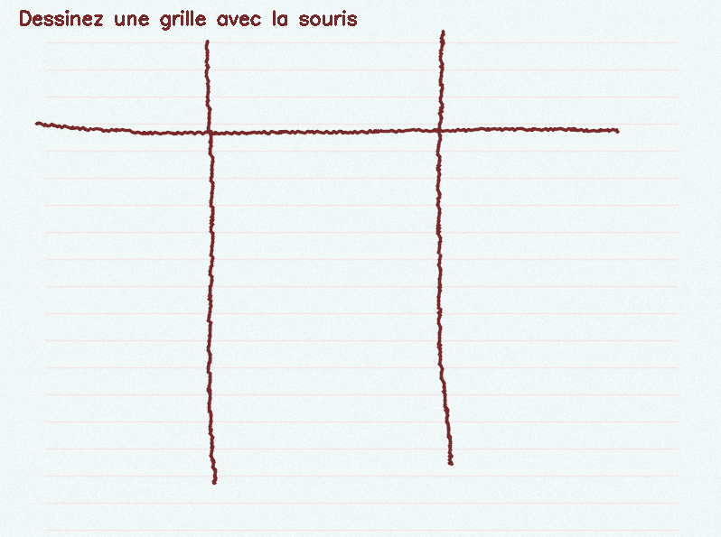
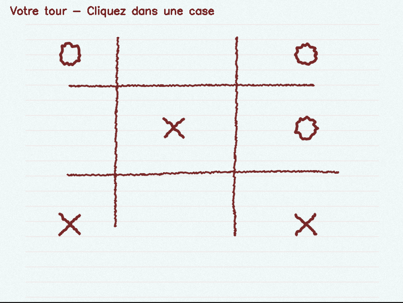
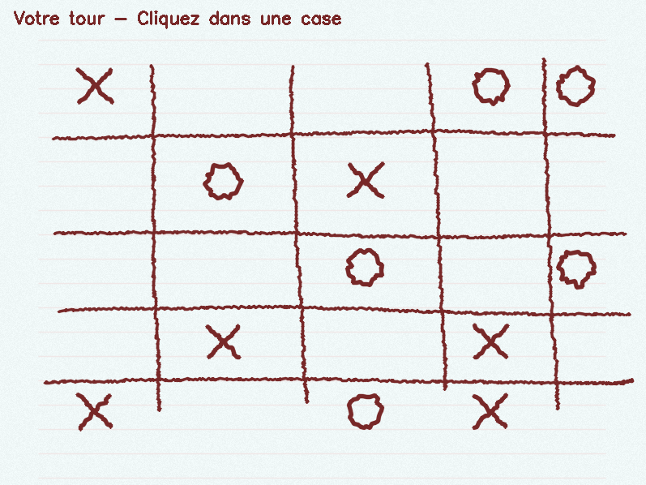

# Morpion Computer Vision

Un jeu de morpion avec vision par ordinateur utilisant OpenCV.

## Fonctionnalités

- Détection automatique de grille dessinée à la main
- Interface de jeu intuitive avec la souris  
- IA stratégique pour jouer contre l'ordinateur
- Esthétique cahier/gribouillage

## Aperçu

### Phase de dessin


### Exemple de grille détectée 3x3


### Exemple de grille détectée 5x5


## Prérequis

- CMake (>= 3.10)
- OpenCV (>= 3.0)
- Compilateur C++17

## Installation et compilation

Cloner le dépôt puis créer un dossier de build :
```bash
git clone https://github.com/ton-compte/morpion-cv.git
cd morpion-cv
mkdir build && cd build
```

Générer et compiler avec CMake :
```bash
cmake ..
make
```

Lancement depuis le dossier build, exécuter :
```bash
./morpion_cv
```

Pour Windows utiliser simplement le fichier `build.bat`
```bash
build.bat Release C:\lien\vers\opencv\build
```

## Contrôles

- Dessiner la grille avec la souris (par exemple 3x3 ou 5x5)

- Cliquer dans une case pour jouer un X

- L’ordinateur joue automatiquement un O

- Touche r : recommencer une partie

- Touche q ou Échap : quitter le jeu